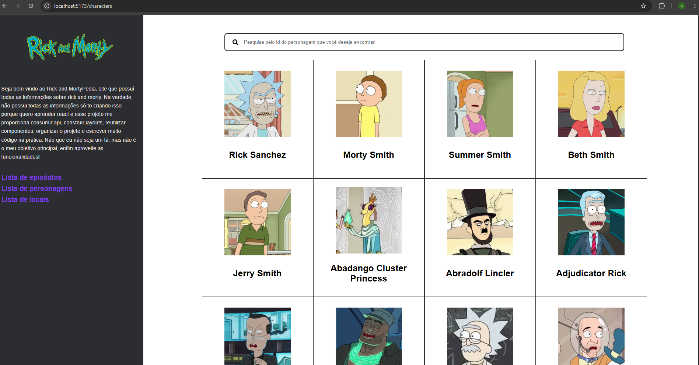

# React + Vite

Uma aplicação para encontrar diversas informações sobre rick and morty, como pesquisar episódios e personagens.

Currently, two official plugins are available:

## preview

## Funcionalidades

- Listagem de todos os episódios de rick and morty
- Listagem de todos os personagens de rick and morty
- Sistema de filtro de personagens e episódios

## Tecnologias utilizadas

- React
- JavaScript
- React Router
- Jsx
- Axios
- CSS Modules
- LocalStorage

## Aprendizados

Durante o desenvolvimento deste projeto, pratiquei:

- Componentização com React
- Gerenciamento de estado
- Consumo de APIs
- Rotas com React Router